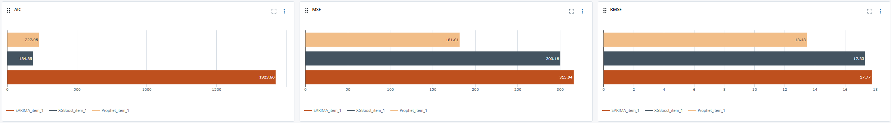
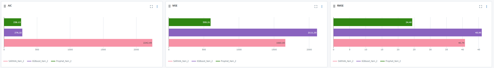
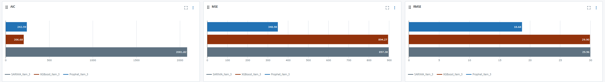

# Previsão de demanda com Séries Temporais

Confira o projeto completo no link abaixo:
[Notebook do Projeto](https://github.com/WiiniSilva/Previsao_de_Demanda/blob/main/Notebook/Previsão_Demanda.ipynb)

Este repositório contém um projeto focado na previsão de demanda com séries temporais utilizando diferentes modelos estatísticos e de machine learning, incluindo SARIMA, XGBoost e Prophet. O objetivo do projeto é analisar e prever a quantidade de produtos vendidos ao longo do tempo, comparando a eficácia dos modelos em três diferentes itens.

## Conteúdo

1. [Visão Geral do Projeto](#Visão-Geral-do-Projeto)
2. [Conjunto de Dados](#Conjunto-de-Dados)
3. [Metodologias](#Metodologias)
4. [Métricas de Avaliação](#Métricas-de-Avaliação)
5. [MLflow e Resultados](#MLflow-e-Resultados)
6. [Conclusão](#Conclusão)
7. [Tecnologias Utilizadas](#Tecnologias-Utilizadas)
8. [Referências](#referências)

## Visão Geral do Projeto

O objetivo deste projeto é desenvolver modelos de previsão de séries temporais para prever a quantidade de itens que a loja deverá adquirir ao longo do tempo, a fim de evitar a perda de vendas ou o custo com estoque de produtos não vendidos. Utilizamos três abordagens distintas — SARIMA, XGBoost e Prophet — para avaliar o desempenho de cada modelo com base em sua acurácia e complexidade.

Cada modelo foi ajustado e avaliado utilizando métricas como Erro Quadrático Médio (RMSE) e Critério de Informação de Akaike (AIC). A análise busca identificar o modelo mais adequado para previsões precisas, equilibrando simplicidade e interpretabilidade.

## Conjuntos de Dados

O projeto utiliza três conjuntos de dados de séries temporais:

* Conjunto de Dados Item 1: Contagem semanal de itens 1 de 2013 a 2017.

* Conjunto de Dados Item 2: Contagem semanal de itens de 2 2013 a 2017.

* Conjunto de Dados Item 3: Contagem semanal de itens de 3 2013 a 2017.

Cada conjunto de dados inclui uma coluna de tempo e valores correspondentes a demanda de cada item.

## Metodologias

SARIMA

O modelo Seasonal Autoregressive Integrated Moving Average (SARIMA) é um modelo estatístico clássico para previsão de séries temporais. Ele inclui termos para componentes sazonais e não sazonais, sendo adequado para dados com sazonalidade clara.

* Os modelos SARIMA foram ajustados para cada conjunto de dados.
* O ajuste envolveu a seleção dos parâmetros (p, d, q)(P, D, Q, s) para minimizar o AIC e o RMSE.

XGBoost

XGBoost é um algoritmo de gradient boosting que geralmente apresenta bom desempenho em dados estruturados. Aqui, os dados foram transformados para permitir uma abordagem de aprendizado supervisionado, com a criação de características como defasagens (lags) e médias móveis.

* A série temporal foi transformada para o formato de aprendizado supervisionado.
* O XGBoost foi aplicado com engenharia de características e ajuste de hiperparâmetros.

Prophet

Prophet é uma ferramenta desenvolvida pelo Facebook para previsão de séries temporais. O modelo foi projetado para capturar automaticamente sazonalidades e tendências, sendo eficaz para dados com múltiplas sazonalidades e valores ausentes.

* O modelo Prophet foi ajustado com parâmetros personalizados de sazonalidade para capturar ciclos anuais.

## Métricas de Avaliação

Para comparar os modelos, utilizamos as seguintes métricas:

* Erro Quadrático Médio (RMSE): Mede a magnitude média dos erros de previsão.

* Critério de Informação de Akaike (AIC): Ajuda a escolher entre os modelos, penalizando a complexidade excessiva.

Valores mais baixos em ambas as métricas indicam melhor desempenho.

## MLflow e Resultados

O MLflow Tracking foi usado para registrar automaticamente todos os experimentos executados durante o ajuste dos modelos de séries temporais. Cada execução foi salva com seus respectivos parâmetros, métricas de desempenho e artefatos gerados, o que facilita a comparação entre diferentes abordagens e configurações de modelos.

Para cada execução, as seguintes informações foram registradas:
* Parâmetros do Modelo: Os parâmetros (p, d, q) e (P, D, Q, s) do modelo SARIMAX, juntamente com as variáveis exógenas usadas (feriados e promoções).
* Métricas de Avaliação: MSE, RMSE, MAE e AIC foram registradas para cada execução, possibilitando a comparação direta entre as iterações.
* Tempo de Execução: O tempo de treinamento de cada modelo foi monitorado, permitindo identificar se o custo computacional justificava o desempenho do modelo.

Item 1

Item 2

Item 3

| Modelo   | RMSE Item 1 | RMSE Item 2 | RMSE Item 3 | AIC Item 1 | AIC Item 2 | AIC Item 3 |
|----------|-------------|-------------|-------------|------------|------------|------------|
| SARIMA   | 17.77       | 40.74       | 29.95       | 1923.60    | 2242.49    | 2081.82    |
| XGBoost  | 16.91       | 45.95       | 29.90       | 183.87     | 276.32     | 206.68     |
| Prophet  | 13.47       | 24.40       | 18.68       | 227.02     | 258.13     | 242.59     |

* Prophet foi o modelo mais preciso em termos de RMSE, superando os outros modelos em todos os conjuntos de dados.

* XGBoost mostrou um desempenho competitivo, com o menor AIC na maioria dos casos, indicando simplicidade de modelo.

* SARIMA, embora menos preciso que o Prophet, forneceu insights interpretáveis sobre os padrões sazonais e autorregressivos dos dados.

## Conclusão

No geral, o Prophet foi o modelo mais eficaz em termos de precisão de previsão, enquanto o XGBoost equilibrou desempenho e simplicidade de modelo, alcançando os menores valores de AIC. Os modelos SARIMA foram úteis para interpretar os padrões de sazonalidade nas séries temporais.

## Tecnologias Utilizadas

* Python 3.12.2
* statsmodels para usar SARIMAX
* XGBoost para aprendizado de máquina
* Prophet para previsão automática de séries temporais
* Matplotlib/Seaborn para visualização de dados
* Pandas e Numpy para manipulação de dados

## Referências

Para mais informações detalhadas sobre as técnicas utilizadas e a implementação do modelo, consulte os links: [Prepáratorio para Entrevistas em Dados (PED)](https://renatabiaggi.com/ped/)
 e [Estatistica do Básico ao Avançado (EBA)](https://renatabiaggi.com/eba/)
